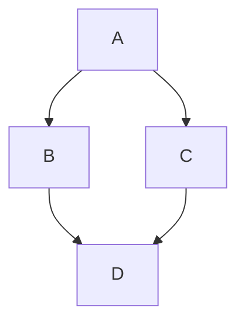

To draw graphs in Obsidian, we can use Mermaid, which built-in and great for flowcharts. Mermaid is a simple markup language for creating diagrams from text. Here is a simple flowchart:


and here is the syntax:
```

```
